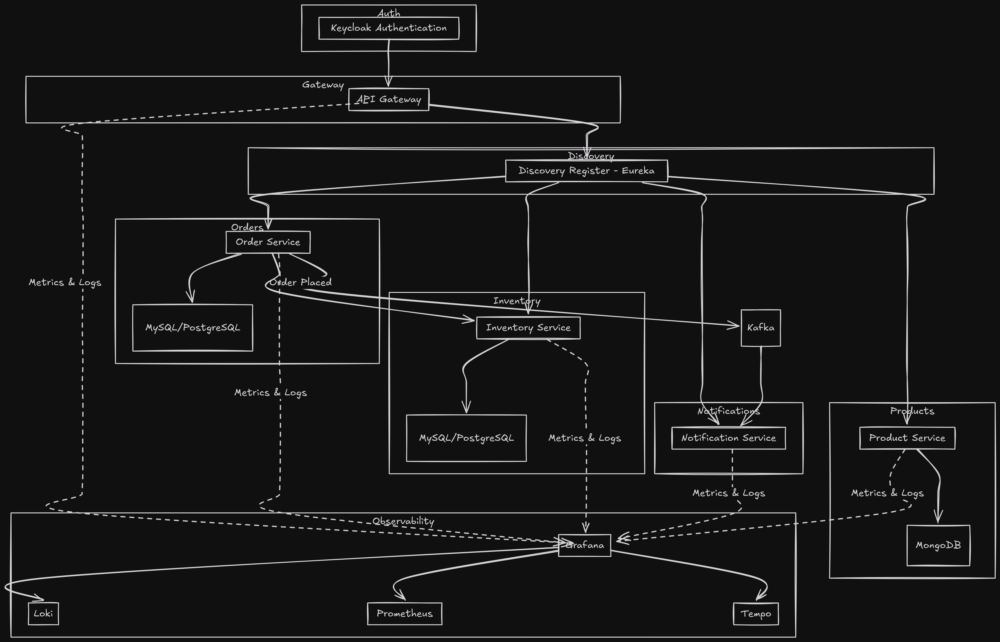
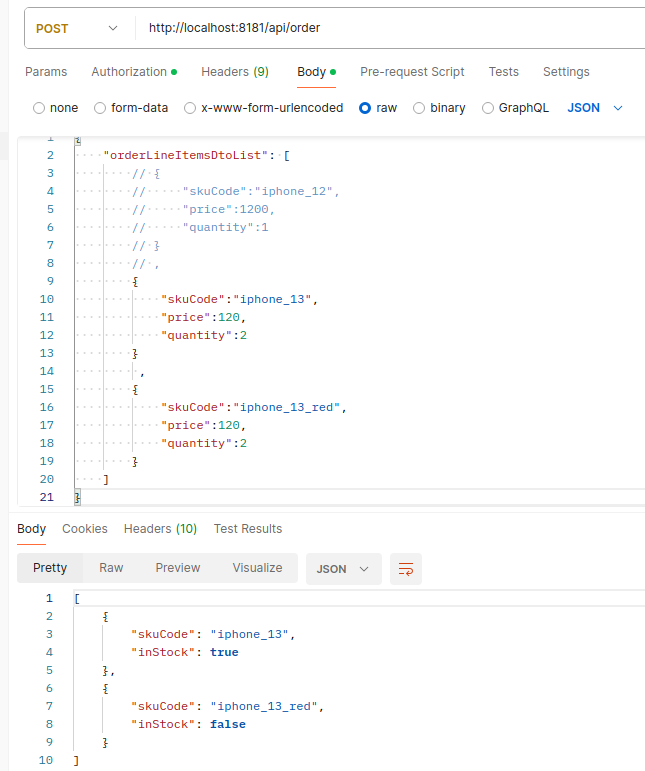
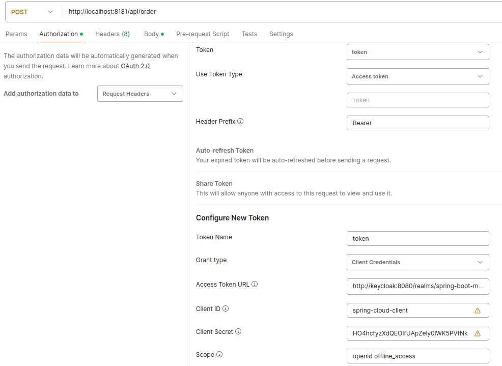

<div style="display: flex; justify-content: space-between; align-items: center;">
  <div>
    <a href="./LICENSE">
      
    </a>
  </div>
  <div>
    <a href="https://www.linkedin.com/in/nazar-zhuhan">
      
    </a>
  </div>
</div>

[linkedin-shield]: https://img.shields.io/badge/LinkedIn-Profile-blue?logo=linkedin

<!-- TABLE OF CONTENTS -->
<details>
  <summary>Table of Contents</summary>
  <ol>
    <li>
      <a href="#about-the-project">About The Project</a>
      <ul>
        <li><a href="#built-with">Built With</a></li>
      </ul>
    </li>
    <li>
      <a href="#getting-started">Getting Started</a>
      <ul>
        <li><a href="#prerequisites">Prerequisites</a></li>
        <li><a href="#installation">Installation</a></li>
      </ul>
    </li>
    <li><a href="#usage">Usage</a></li>
    <li><a href="#roadmap">Roadmap</a></li>
    <li><a href="#contributing">Contributing</a></li>
    <li><a href="#license">License</a></li>
    <li><a href="#contact">Contact</a></li>
    <li><a href="#acknowledgments">Acknowledgments</a></li>
  </ol>
</details>


<!-- ABOUT THE PROJECT -->
## About The Project



[](./screenshots/img.png)

---


## About The Project

The **Order Service** is a Spring Boot-based microservice designed to handle order management within a larger distributed system. This service integrates with various components to provide a robust and scalable solution for managing and processing orders. Below are the key features and functionalities of the Order Service:

- **Microservices Architecture**: Implements both synchronous and asynchronous communication patterns. For asynchronous communication, Kafka is used as the message broker. Synchronous communication is managed with circuit breakers to handle service failures gracefully.

- **Observability**: The project uses a comprehensive observability stack including Grafana, Prometheus, Tempo, and Loki for monitoring, tracing, and logging. Configuration data for these tools is auto-provisioned during startup.

- **Service Discovery**: Eureka is utilized for service registration and discovery, allowing services to locate and communicate with each other efficiently.

- **API Gateway**: An API Gateway is set up as the entry point for all incoming requests, providing routing, load balancing, and security features.

- **Security**: Keycloak is employed as the authentication server to provide Single Sign-On (SSO) functionality, ensuring secure access to the services.

- **Profiles and Configuration**: Profiles are used to streamline development and testing environments, making it easier to manage configurations for different stages of the application lifecycle.

- **Containerization**: Docker is used to containerize the application, facilitating quick deployment and consistency across different environments.

- **Testing**: Plans are in place to include JUnit tests, component tests, and integration tests to ensure the reliability and quality of the service.

This project leverages modern technologies and best practices to build a scalable, secure, and observable microservices-based system.


---

### Key Features
- **Order Management:** Handles the creation and management of orders, including saving order details and processing order line items.
- **Inventory Check:** Interacts with an inventory service to verify stock levels for products before placing an order.
- **Asynchronous/Synchronous Processing:** Utilizes asynchronous processing for placing orders to ensure non-blocking operations and better scalability.
- **Circuit Breaker and Time Limiter:** Employs Resilience4j for circuit breaking and time limiting to enhance the resilience of the service.
- **Distributed Tracing:** Implements distributed tracing using Micrometer to track and monitor the flow of requests across services.
- **Kafka Integration:** Integrates with Kafka for messaging, allowing for asynchronous communication and event-driven processing of order placements in notification service.
- **Metrics and Monitoring:** Configured with Micrometer/Prometheus to collect and expose metrics, and integrates with Loki for centralized log management and analysis.

### Configuration

- **Database:** Configured to connect to a MySQL database for persisting order data.
- **Service Discovery:** Registers with Eureka for service discovery and load balancing.
- **Resilience4j:** Configured with custom circuit breaker and retry policies to handle failures gracefully and provide fallback mechanisms.
- **Tracing and Logging:** Configured to include trace IDs in logs for end-to-end visibility and supports sending logs to Loki for centralized log aggregation.


### Built With

* [![Spring Boot][Spring-Boot]][Spring-Boot-url]
* [![Spring Security][Spring-Security]][Spring-Security-url]
* [![Spring Cloud][Spring-Cloud]][Spring-Cloud-url]
* [![Eureka][Eureka]][Eureka-url]
* [![Kafka][Kafka]][Kafka-url]
* [![MySQL][MySQL]][MySQL-url]
* [![PostgreSQL][PostgreSQL]][PostgreSQL-url]
* [![MongoDB][MongoDB]][MongoDB-url]
* [![Loki][Loki]][Loki-url]
* [![Grafana][Grafana]][Grafana-url]
* [![Prometheus][Prometheus]][Prometheus-url]
* [![Tempo][Tempo]][Tempo-url]
* [![Resilience4j][Resilience4j]][Resilience4j-url]

[Spring-Boot]: https://img.shields.io/badge/Spring%20Boot-3.3.2-green
[Spring-Boot-url]: https://spring.io/projects/spring-boot

[Spring-Security]: https://img.shields.io/badge/Spring%20Security-6.3.1-blue
[Spring-Security-url]: https://spring.io/projects/spring-security

[Spring-Cloud]: https://img.shields.io/badge/Spring%20Cloud-4.1.5-blue
[Spring-Cloud-url]: https://spring.io/projects/spring-cloud

[Eureka]: https://img.shields.io/badge/Eureka-4.1.3-orange
[Eureka-url]: https://spring.io/projects/spring-cloud-netflix

[Kafka]: https://img.shields.io/badge/Kafka-3.2.2-yellow
[Kafka-url]: https://kafka.apache.org/

[MySQL]: https://img.shields.io/badge/MySQL-8.3.0-blue
[MySQL-url]: https://www.mysql.com/

[PostgreSQL]: https://img.shields.io/badge/PostgreSQL-gray
[PostgreSQL-url]: https://www.postgresql.org/

[MongoDB]: https://img.shields.io/badge/MongoDB-4.4.6-green
[MongoDB-url]: https://www.mongodb.com/

[Loki]: https://img.shields.io/badge/Loki-main-blue
[Loki-url]: https://grafana.com/oss/loki/

[Grafana]: https://img.shields.io/badge/Grafana-main-blue
[Grafana-url]: https://grafana.com/

[Prometheus]: https://img.shields.io/badge/Prometheus-2.43.1-blue
[Prometheus-url]: https://prometheus.io/

[Tempo]: https://img.shields.io/badge/Tempo-2.2.2-blue
[Tempo-url]: https://grafana.com/oss/tempo/

[Resilience4j]: https://img.shields.io/badge/Resilience4j-3.1.2-yellow
[Resilience4j-url]: https://resilience4j.readme.io/


## Getting Started

This guide will help you set up and run the project locally using Docker. Follow these steps to get your development environment up and running.

### Prerequisites

Make sure you have the following installed:

* [Docker](https://www.docker.com/get-started)
* [Docker Compose](https://docs.docker.com/compose/install/)

### Installation & Usage

1. **Clone the repository**

   ```sh
   git clone https://github.com/KnOMM/microservices-product
   ```

2. **Navigate to the project directory**

   ```sh
   cd microservices-product
   ```

3. **Build and start the Docker containers in background**

   ```sh
   docker-compose up -d
   ```

   This command will build the Docker images (if needed) and start all the services defined in your `docker-compose.yml` file.

4. **Access the application**

   * After the containers have started, first thing you have to do is get client-secret from keycloak:
go to [http://localhost:8080/](http://localhost:8080/)` -> clients -> spring-cloud-client -> credentials -> regenerate secret`
   * Set up the postman 
   * Make requests to endpoint (see [Appendix](#appendix))

5. **Check logs**

   To view the logs of your running services, you can use:

   ```sh
   docker-compose logs
   ```

6. **Stop the containers**

   When you're done, stop the containers with:

   ```sh
   docker-compose down -v
   ```


## Roadmap

- [x] Feature 1
- [ ] Feature 2
- [ ] Feature 3
    - [ ] Nested Feature

See the [open issues](https://github.com/github_username/repo_name/issues) for a full list of proposed features (and known issues).

<p align="right">(<a href="#readme-top">back to top</a>)</p>


<!-- CONTRIBUTING -->
## Contributing

Contributions are what make the open source community such an amazing place to learn, inspire, and create. Any contributions you make are **greatly appreciated**.

If you have a suggestion that would make this better, please fork the repo and create a pull request. You can also simply open an issue with the tag "enhancement".
Don't forget to give the project a star! Thanks again!

1. Fork the Project
2. Create your Feature Branch (`git checkout -b feature/AmazingFeature`)
3. Commit your Changes (`git commit -m 'Add some AmazingFeature'`)
4. Push to the Branch (`git push origin feature/AmazingFeature`)
5. Open a Pull Request


<!-- LICENSE -->
## License

Distributed under the MIT License. See `LICENSE` for more information.


<!-- CONTACT -->
## Contact

Nazar Zhuhan - [@twitter_handle](https://twitter.com/twitter_handle) - email@email_client.com

Project Link: [https://github.com/github_username/repo_name](https://github.com/github_username/repo_name)


<!-- ACKNOWLEDGMENTS -->
## Acknowledgments

* []()
* [](https://github.com/othneildrew/Best-README-Template/blob/main/BLANK_README.md)


## Appendix

### API Documentation

#### Order Service API

**Check Product Stock**

- **Endpoint:** `POST /api/order`
- **Description:** Check if the products from the list are in stock. This endpoint validates the availability of the products and returns their stock status.
- **URL:** `http://localhost:8181/api/order`
- **Method:** `POST`
- **Headers:**
  - `Content-Type: application/json`
- **Request Body:**

  ```json
  {
      "orderLineItemsDtoList": [
          {
              "skuCode": "iphone_13",
              "price": 120,
              "quantity": 2
          },
          {
              "skuCode": "iphone_13_red",
              "price": 120,
              "quantity": 2
          }
      ]
  }
  ```

**List Products**

- **Endpoint:** `GET /api/product`
- **Description:** Retrieve a list of all available products.
- **URL:** `http://localhost:8181/api/product`
- **Method:** `GET`
- **Headers:**
   - `Content-Type: application/json`

**Add Product**

- **Endpoint:** `POST /api/product`
- **Description:** Add a new product to the inventory.
- **URL:** `http://localhost:8181/api/product`
- **Method:** `POST`
- **Headers:**
   - `Content-Type: application/json`
- **Request Body:**

  ```json
  {
      "name": "IPhone",
      "price": "1200",
      "description": "Cool phone"
  }
  ```
<p align="right">(<a href="#installation--usage">back to installation</a>)</p>
```


[contributors-shield]: https://img.shields.io/github/contributors/github_username/repo_name.svg?style=for-the-badge
[contributors-url]: https://github.com/github_username/repo_name/graphs/contributors
[forks-shield]: https://img.shields.io/github/forks/github_username/repo_name.svg?style=for-the-badge
[forks-url]: https://github.com/github_username/repo_name/network/members
[stars-shield]: https://img.shields.io/github/stars/github_username/repo_name.svg?style=for-the-badge
[stars-url]: https://github.com/github_username/repo_name/stargazers
[issues-shield]: https://img.shields.io/github/issues/github_username/repo_name.svg?style=for-the-badge
[issues-url]: https://github.com/github_username/repo_name/issues
[license-shield]: https://img.shields.io/github/license/github_username/repo_name.svg?style=for-the-badge
[license-url]: https://github.com/github_username/repo_name/blob/master/LICENSE.txt
[linkedin-shield]: https://img.shields.io/badge/-LinkedIn-black.svg?style=for-the-badge&logo=linkedin&colorB=555
[linkedin-url]: https://linkedin.com/in/linkedin_username
[product-screenshot]: images/screenshot.png
[Next.js]: https://img.shields.io/badge/next.js-000000?style=for-the-badge&logo=nextdotjs&logoColor=white
[Next-url]: https://nextjs.org/
[React.js]: https://img.shields.io/badge/React-20232A?style=for-the-badge&logo=react&logoColor=61DAFB
[React-url]: https://reactjs.org/
[Vue.js]: https://img.shields.io/badge/Vue.js-35495E?style=for-the-badge&logo=vuedotjs&logoColor=4FC08D
[Vue-url]: https://vuejs.org/
[Angular.io]: https://img.shields.io/badge/Angular-DD0031?style=for-the-badge&logo=angular&logoColor=white
[Angular-url]: https://angular.io/
[Svelte.dev]: https://img.shields.io/badge/Svelte-4A4A55?style=for-the-badge&logo=svelte&logoColor=FF3E00
[Svelte-url]: https://svelte.dev/
[Laravel.com]: https://img.shields.io/badge/Laravel-FF2D20?style=for-the-badge&logo=laravel&logoColor=white
[Laravel-url]: https://laravel.com
[Bootstrap.com]: https://img.shields.io/badge/Bootstrap-563D7C?style=for-the-badge&logo=bootstrap&logoColor=white
[Bootstrap-url]: https://getbootstrap.com
[JQuery.com]: https://img.shields.io/badge/jQuery-0769AD?style=for-the-badge&logo=jquery&logoColor=white
[JQuery-url]: https://jquery.com 